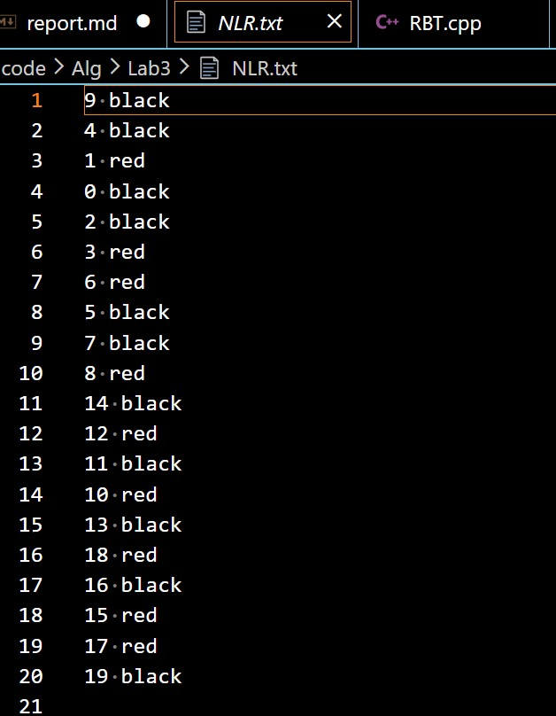
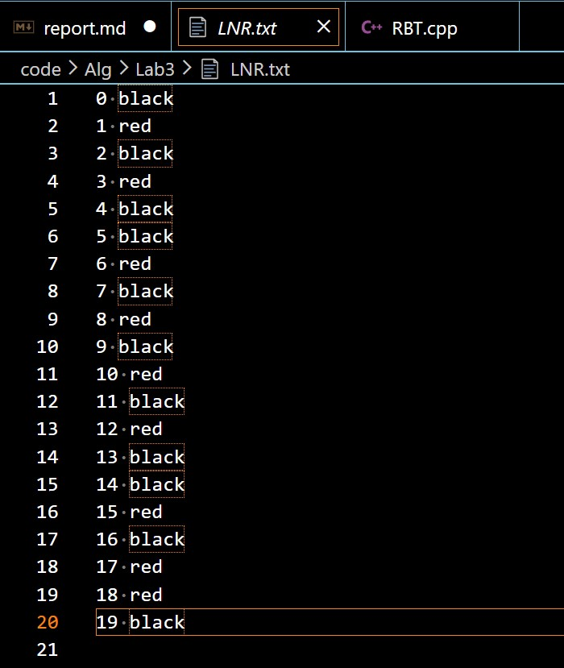
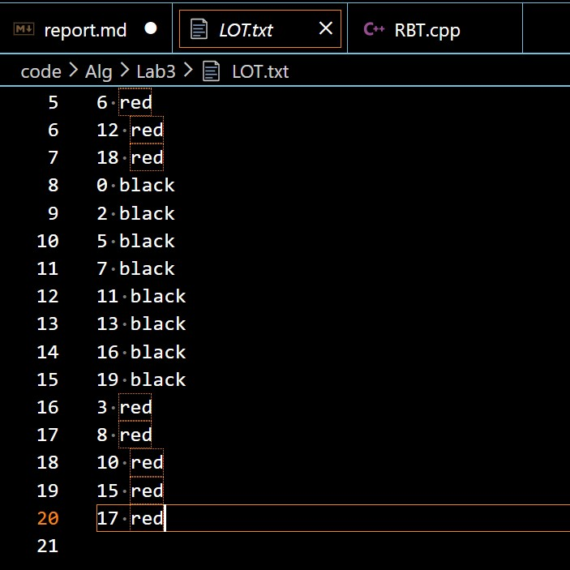
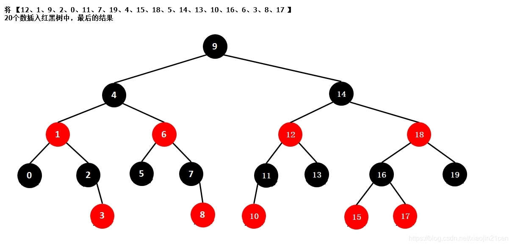

@import "D:\USR\vue.css"

# <center>ALG LAB3</center>


**<center>王世炟 PB20151796**</center>
**<center>2022/10/29</center>**

<center>红黑树插入算法</center>

## 实验内容

本次实验要求我们实现红黑树的插入算法，使得插入后依旧保持红黑性质。

为了完成此算法，我们需要实现 **红黑树节点定义、树的初始化、插入结点、保持红黑性质** 等功能。

## 算法设计思路

### 红黑树结点定义

定义两个结构体 `RBNode` `RBTree` 以实现红黑树的数据结构：

```c++
typedef struct node
{
    Colour color;
    int key;
    struct node *left, *right, *p;
} RBNode, *pRBNode;

typedef struct nodeTree
{
    pRBNode root, NIL;
} RBTree, *pRBTree;

```

### 红黑树初始化

树的初始化，初始化根节点、`NIL` 结点：

```c++
void RBTInit(pRBTree T)
{
    if (T == NULL)
    {
        return;
    }
    T->NIL = new RBNode;
    T->NIL->color = BLACK;
    T->root = T->NIL;
    T->root->p = T->NIL;
    return;
}
```

让 `NIL` 结点的颜色为 `BLACK` 并且让根节点指向 `NIL` 根节点的父节点指向 `NIL` 

### 插入结点

插入算法比较简单，只需找到待插入元素的位置，并将其颜色置红，且左右结点置为 `NIL` ，之后进行红黑性质的保持：

```c++
void RBInsert(pRBTree T, pRBNode z)
{
    pRBNode y = T->NIL;
    pRBNode x = T->root;
    while (x != T->NIL)
    {
        y = x;
        if (z->key < x->key)
        {
            x = x->left;
        }
        else
        {
            x = x->right;
        }
    }
    z->p = y;// 插入根结点时让根节点父节点指向NIL
    if (y == T->NIL)
    {
        T->root = z;
    }
    else if (z->key < y->key)
    {
        y->left = z;
    }
    else
    {
        y->right = z;
    }
    z->left = T->NIL;
    z->right = T->NIL;
    z->color = RED;
    RBInsertFixup(T, z);
    return;
}
```

### 保持红黑性质

在上述插入结点步骤之后，可能引起性质4的冲突(即插入结点的父亲结点也是红色)，这时需要进行以下操作(以插入结点的父结点是=其祖父结点的左孩子为例)：

- **case1** z的叔叔结点为红色，则将父结点与叔叔结点变黑，然后令 z 指向 z 的祖父结点， 矛盾上移；
- **case2** z的叔叔结点为黑色，且z是其父节点的右孩子，则z指向其父节点，并且左旋z, 进入**case3**
- **case3** z的叔叔结点为黑色，且z是其父节点的左孩子，则将z 的父亲节点赋为黑色，并且右旋z的祖父节点。
- **case4、5、6** 同上， 是在 以插入结点的父结点是=其祖父结点的右孩子 的情况下， 将**case1、2、3**中情况左右调换即可。

```c++
void RBInsertFixup(pRBTree T, pRBNode z)
{
    pRBNode y;
    while (z->p->color == RED)
    {
        if (z->p == z->p->p->left)
        {
            y = z->p->p->right;
            if (y->color == RED)
            {
                z->p->color = BLACK;  // case1
                y->color = BLACK;     // case1
                z->p->p->color = RED; // case1
                z = z->p->p;          // case1
                cout << 1;
            }
            else
            {
                if (z == z->p->right)
                {
                    z = z->p;         // case2
                    LeftRotate(T, z); // case2
                    cout << 2;
                }
                z->p->color = BLACK;     // case3
                z->p->p->color = RED;    // case3
                RightRotate(T, z->p->p); // case3
                cout << 3;
            }
        }
        else
        {
            y = z->p->p->left;
            if (y->color == RED)
            {
                z->p->color = BLACK;  // case4
                y->color = BLACK;     // case4
                z->p->p->color = RED; // case4
                z = z->p->p;          // case4
                cout << 4;
            }
            else
            {
                if (z == z->p->left)
                {
                    z = z->p;          // case5
                    RightRotate(T, z); // case5
                    cout << 5;
                }
                z->p->color = BLACK;    // case6
                z->p->p->color = RED;   // case6
                LeftRotate(T, z->p->p); // case6
                cout << 6;
            }
        }
    }
    T->root->color = BLACK;
    return;
}
```

## 算法正确性测试

先序遍历结果：



中序遍历结果：



层次遍历结果：



实际结果：



对比以上结果可发现算法正确！

## 困难及收获

- 很久没写数据结构了，有些生疏。本次实验让我重新捡起了数据结构。
- 更加深入了解了红黑树插入算法的原理，将原本模糊的概念弄清楚了。