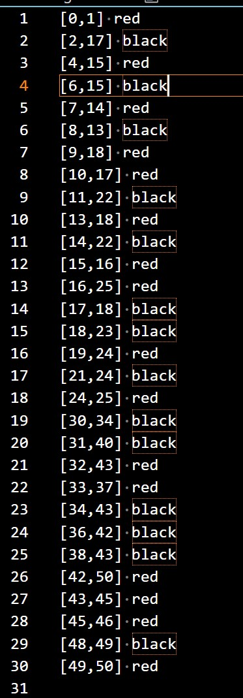
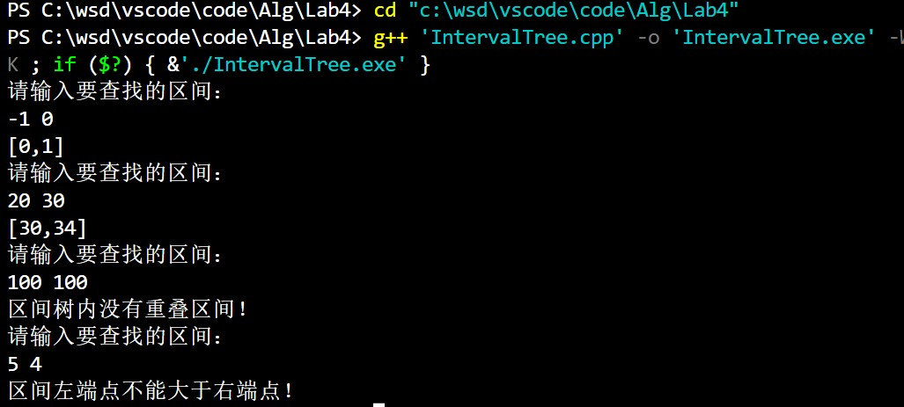

@import "D:\USR\vue.css"

# <center>ALG LAB4</center>


**<center>王世炟 PB20151796**</center>
**<center>2022/11/05</center>**

<center>区间树上重叠区间的查找算法</center>

## 实验内容

本实验要求我们对于红黑树进行修改，使其成为一颗区间树，并实现区间树上重叠区间的查找算法

## 区间树的数据结构

```c++
enum Colour //颜色
{
    RED,
    BLACK,
};

typedef struct Interval
{
    int low;
    int high;
} interval;

typedef struct node
{
    Colour color;
    interval inter;
    int key;
    int max;
    struct node *left, *right, *p;
} RBNode, *pRBNode;

typedef struct nodeTree
{
    pRBNode root, NIL;
} RBTree, *pRBTree;
```


如图，区间树的结点x包括 区间(interval)、max值，并且每一个结点的key值为 `x.int.low`。

## 源码+注释

区间树是由红黑树扩展而来的，二者大部分操作均比较相似。对于本实验而言，主要区别如下：

在树初始化的时候，要将 `T.NIL` 的 `max` 值赋为 **负无穷** ，这样做能省很多繁琐的判断。

```c++
void RBTInit(pRBTree T)
{
    if (T == NULL)
    {
        return;
    }
    T->NIL = new RBNode;
    T->NIL->color = BLACK;
    T->NIL->max = INT32_MIN; // 将NIL结点的max值设为负无穷，即可省去很多判断
    T->root = T->NIL;
    T->root->p = T->NIL;
    return;
}
```

每次插入一个结点后，该节点会影响从此结点到根结点一条路径上的所有结点的 `max` 值，所以每插入一个结点都要进行一次自底向上的 `max` 值更新：

```c++
// 自底向上更新max值
void FixMax(pRBTree T, pRBNode z)
{
    pRBNode x = z;
    while (x != T->NIL)
    {
        x->max = max(max(x->left->max, x->right->max), x->inter.high); // 更新max
        x = x->p; // 向上移动
    }
    return;
}
```

```c++
void RBInsert(pRBTree T, pRBNode z)
{
    pRBNode y = T->NIL;
    pRBNode x = T->root;
    ...
    z->color = RED;
    FixMax(T, z); // 每次插入结束自底向上更新一次max值
    RBInsertFixup(T, z);
    return;
}
```

左旋和右旋也会改变 `max` 值，但只会改变左旋结点及其对应的孩子结点的 `max` ，所以只需要对于旋转之后的两个点进行 `max` 值的更新(先对孩子结点更新，再对父亲结点更新)。

```c++
void LeftRotate(pRBTree T, pRBNode x)
{
    pRBNode y;
    y = x->right;
    ...
    y->left = x;
    x->p = y;
    x->max = max(max(x->left->max, x->right->max), x->inter.high);    // x->max 按照公式更新
    x->p->max = max(max(x->max, x->p->right->max), x->p->inter.high); // y->max 按照公式更新
    return;
}
```

重叠区间的查找算法：

区间重叠的判断条件：两个闭区间 $x,y$ ,若 $x.low>y.high 或 y.low>x.high$ 则区间不重叠，否则则重叠。

```c++
// 判断区间是否重叠
int overlap(interval x, interval y)
{
    if (x.high < y.low || x.low > y.high)
    {
        return 0;
    }
    return 1;
}
```

```c++
// 重叠区间的查找算法
pRBNode IntervalSearch(pRBTree T, interval i)
{
    pRBNode x = T->root;
    while (x != T->NIL && !overlap(i, x->inter))
    {
        if (x->left != T->NIL && x->left->max >= i.low)
        {
            x = x->left;
        }
        else
        {
            x = x->right;
        }
    }
    return x;
}
```

## 算法测试结果

将 `insert.txt` 中的数据插入，并进行中序遍历， 得到的结果应该是按照区间左端点排序的序列：




查询：



## 实验过程中遇到的困难及收获

- 对于数据结构的扩张--区间树有了更加深刻的理解
- 在扩张的过程中维护扩张的性质需要保证时间复杂度仍为 $O(\log n)$