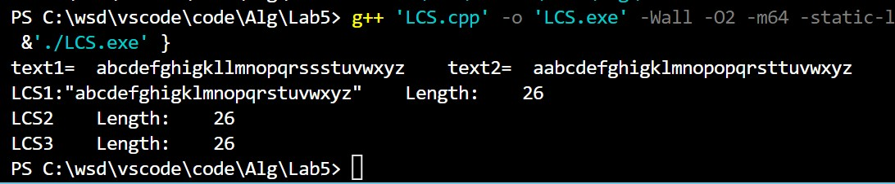

@import "D:\USR\vue.css"

# <center>ALG LAB5</center>


**<center>王世炟 PB20151796**</center>
**<center>2022/11/12</center>**

<center>最长公共子序列（LCS）</center>

## 实验内容

1. 编程实现最长公共子序列（LCS）算法，并理解其核心思想。
2. 时间复杂度 $O(mn)$，空间复杂度 $O(mn)$，求出 LCS 及其长度。
3. 时间复杂度 $O(mn)$，空间复杂度 $O(2*min(m,n))$，求出 LCS 的长度。
4. 时间复杂度 $O(mn)$，空间复杂度 $O(min(m,n))$，求出 LCS 的长度。

## 算法设计思路

该问题可以用动态规划的思想解决：

$$
c[i,j]=
\begin{cases}
    0~~~&若i=0或j=0\\
    c[i-1, j-1]&若i,j >0且x_i = y_i\\
    max(c[i,j-1],c[i-1, j]) &若i,j >0且x_i \not ={y_i}
\end{cases}
$$

**方法一：**
时间复杂度 $O(mn)$，空间复杂度 $O(mn)$，维护两个表$c[0..m0..n],b[1..m,1..n]$ 分别用来记录子问题的解以及构造子问题解的方向。

**方法二：**
时间复杂度 $O(mn)$，空间复杂度 $O(2*min(m,n))$, 
每一步计算只需要上一行和本行的数据， 只需要两行记录即可

**方法三：**
时间复杂度 $O(mn)$，空间复杂度 $O(min(m,n))$ ,事实上，计算 $c[i][j]$ 仅需要 $c[i-1][j],c[i][j-1],c[i-1][j-1]$ 即可，所以我们可以仅用一个数组a记录，a中元素储存的内容如下：

$$
\begin{cases}
    a[k] = c[i,k], &if ~~1\leq k<j-1\\
    a[k] = c[i-1,k] &if ~~k\geq j-1\\
    a[0] = c[i,j-1]
\end{cases}
$$

而计算 $c[i][j]$ 需要的三个值在 $a$ 中分别为：
$c[i-1][j]=a[j],c[i][j-1]=a[0],c[i-1][j-1]=a[j-1]$

算好之后将 $a[0]$ 放入 $a[j-1]$ , $c[i,j]$ 放入 $a[0]$ 即可。

## 源码+注释

**方法一：**
```c
void Print_LCS(char X[], int m, int n)
{
    if (m == 0 || n == 0)
    {
        return;
    }
    if (b[m - 1][n - 1] == Up_Left)
    {
        Print_LCS(X, m - 1, n - 1); // 向左上方移动
        cout << X[m - 1]; // 打印相等的字符
    }
    else if (b[m - 1][n - 1] == Up)
    {
        Print_LCS(X, m - 1, n); // 向上方移动
    }
    else
    {
        Print_LCS(X, m, n - 1); // 向左移动
    }
    return;
}

// 空间复杂度 O(m*n) 的算法
int LCS1(char text1[], char text2[])
{
    int m, n;
    m = strlen(text1);
    n = strlen(text2);

    for (int i = 1; i < m + 1; i++)
    {
        c[i][0] = 0; // 初始化第一行
    }
    for (int j = 0; j < n + 1; j++)
    {
        c[0][j] = 0; // 初始化第一列
    }
    for (int i = 0; i < m; i++)
    {
        for (int j = 0; j < n; j++)
        {
            // 转移方程
            if (text1[i] == text2[j])
            {
                c[i + 1][j + 1] = c[i][j] + 1;
                b[i][j] = Up_Left;
            }
            else if (c[i][j + 1] >= c[i + 1][j])
            {
                c[i + 1][j + 1] = c[i][j + 1];
                b[i][j] = Up;
            }
            else
            {
                c[i + 1][j + 1] = c[i + 1][j];
                b[i][j] = Left;
            }
        }
    }
    if (c[m][n]) // 若c[m][n]不为0，则打印LCS
    {
        cout << "LCS1:\"";
        Print_LCS(text1, m, n);
        cout << "\"";
    }

    return c[m][n];
}
```

**方法二：**
```c
// 空间复杂度 O(2*min(m,n)) 的算法
int LCS2(char text1[], char text2[])
{
    int m, n;
    m = strlen(text1);
    n = strlen(text2);
    int min = m > n ? n : m; // 找最小值
    for (int i = 0; i < min + 1; i++)
    {
        lcs2_1[i] = 0; // 初始化第一行
    }
    lcs2_2[0] = 0; // 将最左侧为0当做已知
    if (m > n)
    {
        for (int i = 0; i < m; i++)
        {
            for (int j = 0; j < n; j++)
            {
                // 转移方程
                if (text1[i] == text2[j])
                {
                    lcs2_2[j + 1] = lcs2_1[j] + 1;
                }
                else if (lcs2_2[j] >= lcs2_1[j + 1])
                {
                    lcs2_2[j + 1] = lcs2_2[j];
                }
                else
                {
                    lcs2_2[j + 1] = lcs2_1[j + 1];
                }
            }
            for (int k = 0;k < n + 1; k++)
            {
                lcs2_1[k] = lcs2_2[k]; // 动态滚动数组
            }
            
        }
    }
    else
    {
        for (int i = 0; i < n; i++)
        {
            for (int j = 0; j < m; j++)
            {
                if (text1[j] == text2[i])
                {
                    lcs2_2[j + 1] = lcs2_1[j] + 1;
                }
                else if (lcs2_2[j] >= lcs2_1[j + 1])
                {
                    lcs2_2[j + 1] = lcs2_2[j];
                }
                else
                {
                    lcs2_2[j + 1] = lcs2_1[j + 1];
                }
            }
            for (int k = 0;k < m + 1; k++)
            {
                lcs2_1[k] = lcs2_2[k];
            }
        }
    }
    return lcs2_2[min];
}
```

**方法三：**
```c
/ 空间复杂度 O(min(m,n)) 的算法
int LCS3(char text1[], char text2[])
{
    int m, n;
    int temp;
    m = strlen(text1);
    n = strlen(text2);
    int min = m > n ? n : m;
    for (int i = 0; i < min + 1; i++)
    {
        lcs3[i] = 0;
    }
    if (m > n)
    {
        for (int i = 0; i < m; i++)
        {
            lcs3[0] = 0;
            for (int j = 0; j < n; j++)
            {
                // 转移方程
                if (text1[i] == text2[j])
                {
                    temp = lcs3[j] + 1;
                    lcs3[j] = lcs3[0];
                    lcs3[0] = temp;
                }
                else
                {
                    lcs3[j] = lcs3[0];
                    lcs3[0] = max(lcs3[j + 1], lcs3[0]);
                }
            }
            lcs3[n] = lcs3[0];
        }
    }
    else
    {
        for (int i = 0; i < n; i++)
        {
            lcs3[0] = 0;
            for (int j = 0; j < m; j++)
            {
                if (text1[j] == text2[i])
                {
                    temp = lcs3[j] + 1;
                    lcs3[j] = lcs3[0];
                    lcs3[0] = temp;
                }
                else
                {
                    lcs3[j] = lcs3[0];
                    lcs3[0] = max(lcs3[j + 1], lcs3[0]);
                }
            }
            lcs3[m] = lcs3[0];
        }
    }
    return lcs3[min];
}
```

## 实验结果

