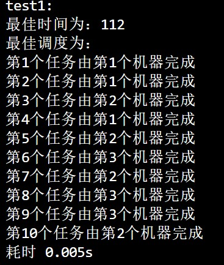
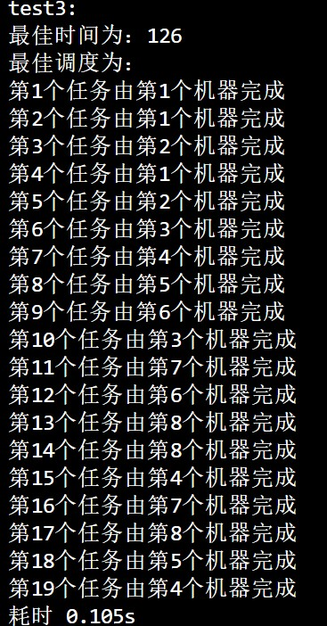

"D:\USR\vue.css"

# <center>ALG LAB7</center>


**<center>王世炟 PB20151796**</center>
**<center>2022/11/26</center>**

<center>最佳调度问题的回溯算法</center>

---

## 实验内容

设有 n 个任务由 k 个可并行工作的机器来完成，完成任务 i 需要时间为$i_t$。试设计一个算法找出完成这 n 个任务的最佳调度，使完成全部任务的时间最早。（要求给出调度方案）。

## 算法设计思路

首先，回溯算法的原理是去用深度优先搜索去搜索解空间树。

考虑把任务分配给机器，那么首先将所有任务分配给第一个机器，到达叶子结点后检测是否为更好的策略，返回上一层递归，继续搜索。

**剪枝：**

剪枝1：该问题的最佳时间是所有机器所花时间的最大值 $\max \{robot[1..k]\}$。在搜索过程中，每当更新 $robot[i]$ 时，变将其与当前的最佳时间比较，若已经比最佳时间大，那么就可以确定这种方案不是最佳，不必继续搜索。

剪枝2：原理同上，在每次开始递归之前，检查当前的 $\max \{robot[1..k]\}$，若已经比最佳时间大，那么就可以确定这种方案不是最佳，不必继续搜索。

剪枝3：对于任务来说，被哪个机器执行，结果是相同的，即机器之间没有区别。例如：序列（第i个任务分配给第k个机器人 $1111111$ 与 $2222222$ 是等价的。由此出发，当要更新 $robot[k]$ 时，若 $robot[1..k-1]$ 中有与 $robot[k]$ 相等的，那么对于 $robot[k]$ 的更新在之前已经做过了，不必继续搜索。

## 源码+注释

```c
#include <bits/stdc++.h>

using namespace std;

int n;                // 任务数
int k;                // 机器数
int *t;               // 完成任务 i 需要的时间 为t[i]
int *robot;           // 第 i 个机器人完成被分配的任务所花的时间
int *task_robot;      // 任务与机器人的映射
int *seq;             // 最佳任务分配序列
int best = INT32_MAX; // 最佳时间

void BestScheduling(int i)
{
    if (best <= *max_element(robot, robot + k)) // 剪枝
    {
        return;
    }
    if (i > n - 1)
    {
        if (best > *max_element(robot, robot + k)) // 到达叶子结点，检查是否为更好的策略
        {
            for (int m = 0; m < n; m++)
            {
                seq[m] = task_robot[m]; // 更新分配序列
            }
            best = *max_element(robot, robot + k);
        }
        return;
    }
    else
    {
        // 剪枝，将k个机器视为等价，若任务的时间（时间和）相等，则也可以把任务视为等价
        for (int j = 0; j < k; j++)
        {
            int flag = 1;
            for (int m = 0; m < j; m++)
            {
                if (robot[j] == robot[m])
                {
                    flag = 0;
                    break;
                }
            }
            if (!flag)
            {
                continue;
            }

            if (robot[j] + t[i] < best) // 剪枝
            {
                robot[j] = robot[j] + t[i];
                task_robot[i] = j;
                BestScheduling(i + 1);
                robot[j] = robot[j] - t[i]; // 回溯
            }
        }
    }
    return;
}

void fun(string FileName)
{
    clock_t begin, end;
    ifstream infile(FileName, ios_base::in);
    infile >> n;
    infile >> k;
    t = new int[n];
    task_robot = new int[n];
    seq = new int[n];
    robot = new int[k];
    for (int i = 0; i < k; i++)
    {
        robot[i] = 0;
    }
    for (int i = 0; i < n; i++)
    {
        infile >> t[i];
        task_robot[i] = -1;
        seq[i] = -1;
    }
    infile.close();
    // sort(t, t+n, greater<int>());
    begin = clock();
    BestScheduling(0);
    cout << "最佳时间为：" << best << endl;
    cout << "最佳调度为：" << endl;
    for (int i = 0; i < n; i++)
    {
        cout << "第" << i + 1 << "个任务由第" << seq[i] + 1 << "个机器完成" << endl;
    }
    end = clock();
    cout << "耗时 " << (double)(end - begin) / CLK_TCK << "s" << endl;
    delete [] t;
    delete [] task_robot;
    delete [] seq;
    delete [] robot;
    best = INT32_MAX;
    return;
}

int main()
{
    cout << "test1:" << endl;
    fun("test1.txt");    
    cout << "test2:" << endl;
    fun("test2.txt");
    cout << "test3:" << endl;
    fun("test3.txt");
    return 0;
}
```

## 算法测试结果

<center>
	
	&emsp;&emsp;
	
    &emsp;&emsp;
	
	<br/>
</center>

test1最短时间为112  
test2最短时间为182  
test3最短时间为126  
